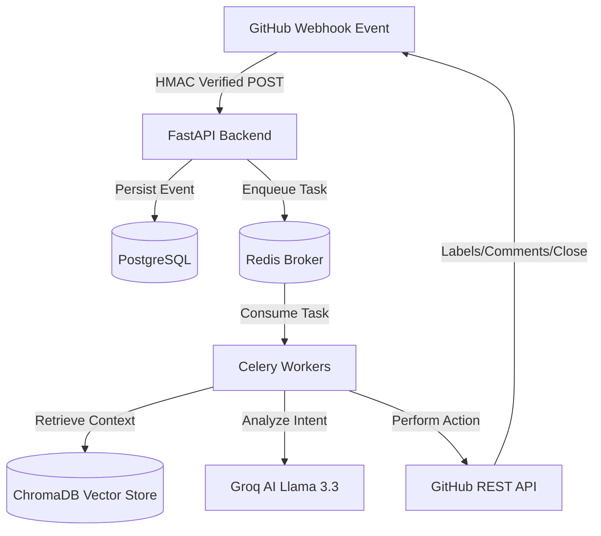

# 🌌 PRobot: AI-Powered GitHub Maintainer Assistant

[](LICENSE)
[](https://fastapi.tiangolo.com)
[](https://react.dev)
[](https://www.docker.com)
[](https://docs.celeryq.dev/)
[](https://groq.com)
[](https://www.trychroma.com)

**PRobot** is an autonomous AI-powered assistant designed for open-source maintainers, developers, and engineering teams. It handles the exhausting initial triage workflows, detects duplicates, evaluates pull request quality, categorizes issue reports, and answers developer questions using a local vector store.

PRobot de-couples webhook HTTP responses from heavy AI execution using **Redis & Celery**, achieving sub-10ms response times for GitHub webhooks, keeping rate limits secure, and maintaining the clean state of repositories.

---

## 1. Project Overview

### The Problem
Open-source software forms the digital foundation of modern tech stacks. However, repository maintenance is exhausting. Maintainers spend countless hours:
- Manually triaging issue reports and chasing down missing tracebacks, OS names, or log parameters.
- Reviewing redundant, duplicate issue submissions.
- Evaluating pull requests that lack descriptions, unit tests, or linked issues.
- Answering the same onboarding and database configuration questions repeatedly.

### The Solution: PRobot
PRobot automates these workflows directly in the repository. It listens to secure GitHub webhooks and executes background AI workflows:
- **Intelligent Triage**: Requests missing logs, tracebacks, OS, or version details.
- **Smart Labeling**: Assigns labels like `bug`, `documentation`, `question`, and `enhancement`.
- **Duplicate Detection**: Flags and closes duplicate issues before maintainers read them.
- **PR Quality Checks**: Automatically reviews description length, test coverage, and breaking changes.
- **RAG Knowledge Assistant**: Answers technical setup and configuration questions using local repository documentation.

---

## 2. Solution Overview & Key Features

### 📝 Smart Issue Triage
- **Description**: Analyzes incoming issues and prompts Groq for a checklist of missing information based on predicted categories (e.g. `OS` and `Command output` for installation issues; `Reproduction steps` and `Logs` for bugs).
- **Example Workflow**:
  - *User opens issue*: "Application crashes on login."
  - *PRobot Comments*:
    ```markdown
    🤖 **PRobot Triage Assistant**
    
    Please provide the following missing details:
    - [ ] Logs
    - [ ] Environment details
    ```
- **Benefits**: Eliminates back-and-forth communication, saving hours of maintainer time.

### 🏷️ Smart Auto Labeling
- **Description**: Classifies issue and PR text using LLM taxonomy and applies label tags immediately via the GitHub API.
- **Example Workflow**:
  - *User opens issue*: "Add dark mode support to the settings menu."
  - *PRobot Actions*: Classifies as `enhancement` / `feature-request` and applies those label badges.
- **Benefits**: Keeps the repository clean, structured, and easy to search.

### 🔍 Duplicate Issue Detection
- **Description**: Generates text embeddings using FastEmbed and indexes issues in ChromaDB. If a new issue matches an existing issue (Cosine Similarity > 0.90), it comments and closes it.
- **Example Workflow**:
  - *User opens issue*: "Login page fails." (Similarity: 0.94 with #10 "Login page crashes")
  - *PRobot Comments*:
    ```markdown
    🤖 **PRobot Duplicate Detector**
    Potential duplicate detected of #10. Closing this issue to consolidate discussion.
    ```
  - *PRobot Actions*: Closes issue, applies `duplicate` label.
- **Benefits**: Prevents redundant reviews and ticket clutter.

### 🛡️ PR Quality Guardian
- **Description**: Automatically scans pull requests to check description length, linked issues, and test coverage (verifying if tests are modified when source files change).
- **Example Workflow**:
  - *User opens PR*: "Fix database pool leaks" (with no unit tests or descriptions).
  - *PRobot Comments*:
    ```markdown
    🤖 **PRobot PR Quality Guardian**
    - [ ] PR description too short.
    - [ ] No linked issue detected.
    - [ ] Tests missing.
    ```
- **Benefits**: Maintains codebase quality and coverage standards.

### 📖 Repository Knowledge Assistant
- **Description**: A RAG-powered vector search engine indexed on Markdown files and historically resolved issues to answer contributor questions.
- **Example Workflow**:
  - *User asks*: "How do I start the database?"
  - *PRobot Comments*:
    ```markdown
    🤖 **PRobot Knowledge Assistant**
    Run `make run` to boot the server. PostgreSQL is available on port 5432.
    ```
- **Benefits**: Answers setup questions instantly, helping new developers onboard faster.

---

## 3. Architecture



### Component Explanation
1. **GitHub Webhooks**: Delivers secure events signed with HMAC-SHA256.
2. **FastAPI Web Server**: Verifies signatures, writes raw events to PostgreSQL, enqueues Celery task coordinates via Redis, and returns HTTP 202 in <10ms.
3. **Redis Broker**: Manages background task queues.
4. **Celery Worker**: Performs asynchronous AI processing (LLM reasoning, embedding vectors, ChromaDB lookup).
5. **PostgreSQL**: Stores relational schemas (repositories, webhook_events, issues, PRs, comments).
6. **ChromaDB**: Holds vector embeddings of documents and resolved issues for duplicate check & RAG.
7. **Groq AI**: Llama-3.3-70b-versatile provides lightning-fast reasoning and structured JSON output.

---

## 4. Tech Stack

- **Backend**: FastAPI, Python 3.10+, SQLAlchemy (ORM), Alembic (Migrations).
- **Task Queue**: Celery, Redis Broker.
- **Database**: PostgreSQL (Relational cache).
- **Vector Database**: ChromaDB, BAAI/bge-small-en-v1.5 (via FastEmbed).
- **AI Inference**: Groq SDK (`llama-3.3-70b-versatile`).
- **Frontend**: React, Vite, Tailwind CSS (v3).
- **Containerization**: Docker, Docker Compose.

---

## 5. Interface & Simulator Previews

### Landing Page & Space Portal Hero
*A premium cosmic landing page with a two-column Hero section, hosting the customized dark space workflow graphic, neon portal highlights, and float animations.*


### Webhook Simulator Sandbox
*A sandbox where you can click pre-built payloads (Bug, Docs, PR Quality, RAG QA) and trigger Celery console logging and GitHub mock comments.*

| Selector Panel | Console Logs Output | Visual Comment Feedback |
|---|---|---|
| Select issue category card | Watch active step-by-step Celery logs | Inspect final posted comment & applied labels |

---

## 6. Project Structure

```
PRobot/
├── backend/                  # FastAPI Web Server & Celery Workers
│   ├── app/
│   │   ├── api/              # API Endpoints (health, webhooks, metrics)
│   │   ├── core/             # Configuration, database engine, Celery app
│   │   ├── models/           # SQLAlchemy schemas (Issues, PRs, Comments)
│   │   ├── repositories/     # Database repository pattern
│   │   ├── services/         # Core business logic (GitHub, Groq, ChromaDB)
│   │   ├── workers/          # Celery tasks
│   │   └── utils/            # Hashing and signature helpers
│   ├── migrations/           # Alembic migration revisions
│   ├── tests/                # Pytest suites
│   ├── Dockerfile
│   └── docker-compose.yml
├── frontend/                 # React, Vite, and Tailwind CSS app
│   ├── src/
│   │   ├── assets/           # Media graphic files (workflow.png)
│   │   ├── App.jsx           # Cosmic Hero, Features, Webhook Simulator
│   │   └── index.css         # Keyframe float animations, portal styles
│   └── package.json
└── docs/                     # Comprehensive Developer Guides
    ├── architecture.md
    ├── database.md
    ├── webhooks.md
    └── deployment.md
```

---

## 7. Local Development Setup

### Environment Configuration
1. Create a `.env` file in the `backend/` directory based on `backend/.env.example`:
   ```env
   GITHUB_TOKEN=ghp_yourpersonalaccesstokenhere
   GITHUB_WEBHOOK_SECRET=your_webhook_secret_here
   GROQ_API_KEY=gsk_yourgroqapikeyhere
   ```
   *Make sure these are not placeholder strings; operational services will validate them at startup.*

### Option A: Running with Docker Compose (Recommended)
This boots the database, Redis broker, Celery worker, and FastAPI server automatically:
```bash
cd backend
docker compose up --build
```
The FastAPI server will be available at `http://localhost:8000`.

### Option B: Running Locally (Python virtualenv)
1. **Prerequisites**: Boot local instances of PostgreSQL (port 5432) and Redis (port 6379).
2. **Setup backend**:
   ```bash
   cd backend
   python -m venv venv
   source venv/bin/activate  # On Windows: venv\Scripts\activate
   pip install -r requirements.txt
   ```
3. **Run migrations**:
   ```bash
   alembic upgrade head
   ```
4. **Start Web Server & Celery Worker**:
   ```bash
   # Terminal 1: FastAPI Uvicorn
   uvicorn app.main:app --host 127.0.0.1 --port 8000 --reload
   
   # Terminal 2: Celery Worker
   celery -A app.core.celery_app.celery_app worker --loglevel=info
   ```

### Setup Frontend
1. Navigate to the frontend directory:
   ```bash
   cd frontend
   npm install
   npm run dev
   ```
2. Open `http://localhost:5173` in your browser.

---

## 8. API Overview

- **`GET /api/v1/health`**: Performs diagnostics on PostgreSQL and Redis databases.
- **`POST /api/v1/webhooks/github`**: Intake endpoint for GitHub secure event webhooks.

---

## 9. Future Scope
1. **Multi-Repository Architecture**: Support context switching across thousands of GitHub repositories.
2. **Slack & Discord Webhooks**: Dispatch triage alerts to team communication channels.
3. **Autonomous Patch Gen**: Review tracebacks, write code fixes, and submit pull requests automatically.
4. **Developer Analytics Dashboard**: Detailed metrics explaining triage speed, label counts, and RAG resolution rates.

---

## 10. Contributing & License

We welcome contributions! Please review our [CONTRIBUTING.md](CONTRIBUTING.md) and [CODE_OF_CONDUCT.md](CODE_OF_CONDUCT.md) for details on code standards, branch naming, and community behavior.

Distributed under the MIT License. See `LICENSE` for more information.

---

## 11. Acknowledgements
- Powered by the **Heaven Hill** Automation Team.
- Powered by the Groq Llama 3.3 AI Model group.
